<!-- See https://squidfunk.github.io/mkdocs-material/reference/ -->

# Part 5: Deploy Prism Central

Many of the more powerful capabilities of Nutanix are only unlocked after configuring [Prism Central](https://portal.nutanix.com/page/documents/details?targetId=Prism-Central-Guide-vpc_2023_4:mul-pc-overview-c.html). In this part of the workshop, we will deploy Prism Central on our Nutanix cluster.

## Steps

### 1. Open Prism UI

Let's return to the Prism UI from your computer at `https://localhost:9440`. Note that the Prism UI ships with a self-signed TLS certificate, so most browsers will display a security warning. This security warning is unavoidable. If your browser will allow you to ignore the warning and load the site, do that; if not, try a different browser.

### 2. Set up Virtual IP, ISCSI IP, and NTP for the Cluster

Prism Central requires an iSCSI IP address for the cluster. This address is used to provide storage to the Prism Central service.

In the next part we'll be installing a service that requires the cluster have a virtual IP as well as NTP configured, so we'll be configuring that now as well.

Click on the gear icon in the upper right corner of the Prism UI. Then choose `Cluster Details` and enter `192.168.103.254` for the Virtual IP and `192.168.103.253` for the ISCSI Data Services IP and and click `Save`.

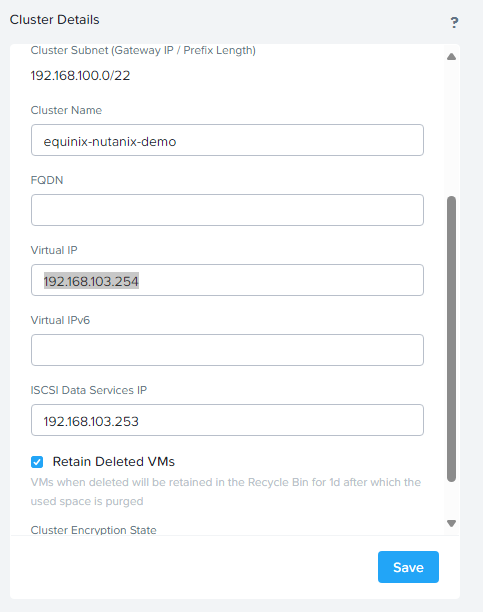

We also need to configure NTP for the cluster. Click on the gear icon in the upper right corner of the Prism UI and select `NTP Servers` from the settings menu on the left. Then add a local NTP pool server for the region you deployed Nutanix into. We'll use `0.north-america.pool.ntp.org`

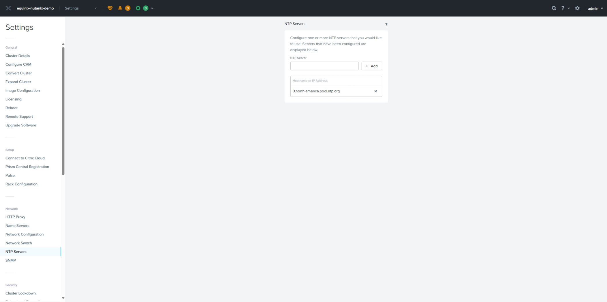

### 3. Deploy Prism Central

Next, choose `Prism Central Registration` and select `Register or create new`.

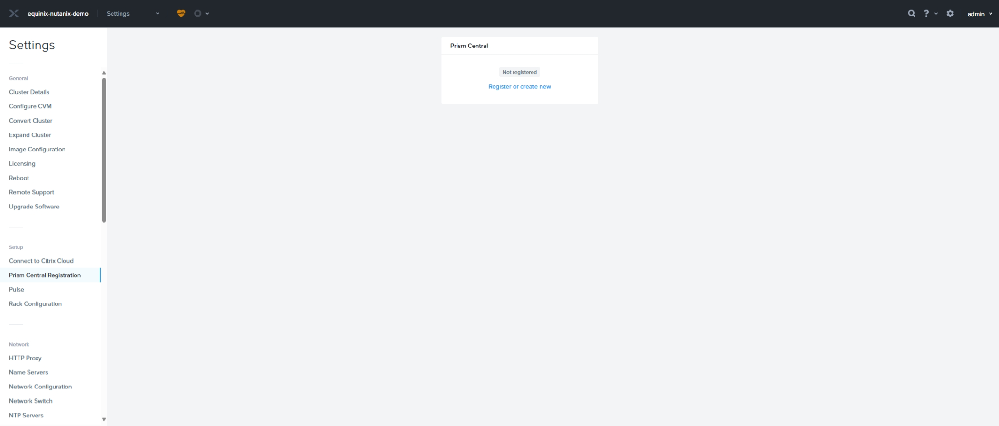

Choose `Deploy`, pick whatever version it offers you and click `Next`.

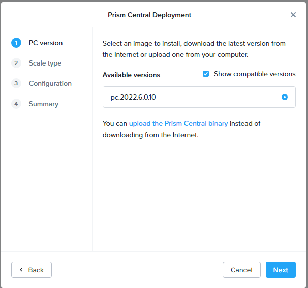

and then `Deploy Single-VM PC` and click `Next`.

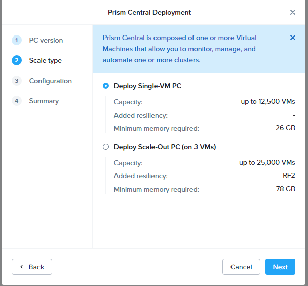

Then choose `Small` and choose `Create Network` from the `Network` drop down.

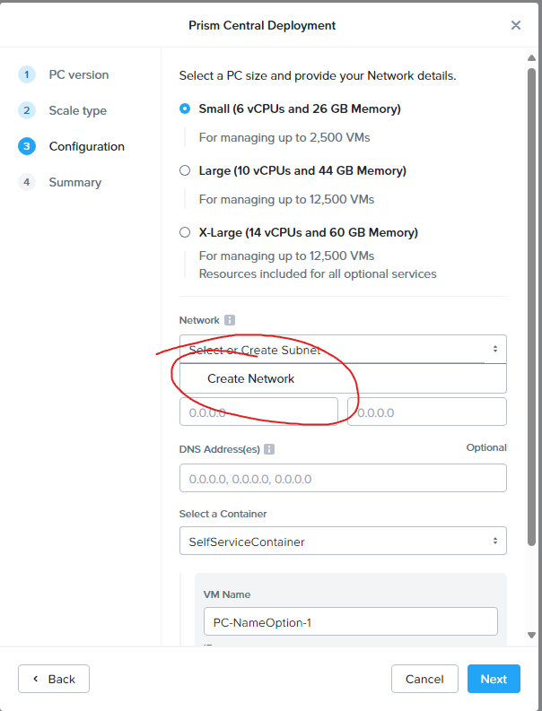

Enter `VM Network` and VLAN ID `0` and click `Save`.

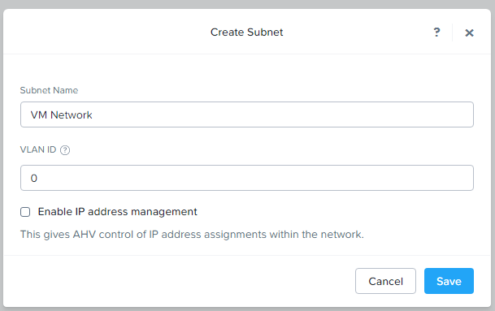

Now enter `255.255.252.0` for the Subnet Mask and `192.168.100.2` for the Gateway, and `192.168.103.252` for the VM IP and click `Next` followed by `Deploy`.

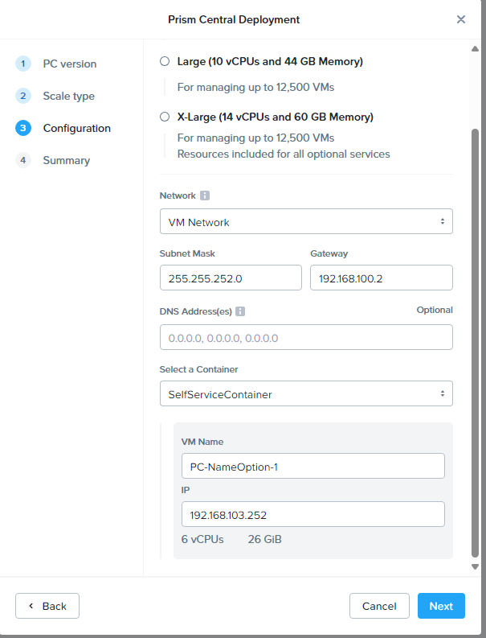

Now be patient while Prism Central installs. This can take a while. When finished, you'll be back at the `Register or create new` screen again. That's normal. Let's verify Prism Central is installed by checking the VM tab and looking for the Prism Central VM. This screenshot has highlighted ways to identify the VM.

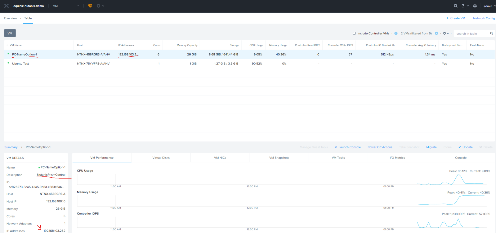

### 4. Log in to Prism Central and Change its Password

Now we need to login to Prism Central. We recommend doing this in a separate web browser or a Private/Incognito window. You can access the Prism Central UI from your computer at `https://localhost:19440`. Note that the Prism Central UI ships with a self-signed TLS certificate, so most browsers will display a security warning. This security warning is unavoidable. If your browser will allow you to ignore the warning and load the site, do that; if not, try a different browser.

Log in to the Prism UI using the default credentials [found here on the Nutanix Support Portal](https://portal.nutanix.com/page/documents/details?targetId=AHV-Admin-Guide-v6_7:app-admin-cvm-access-c.html). You will be forced to change the password when you first log in. After changing the password, you will be automatically logged out.

### 4. Register the Prism Central VM

Now that Prism Central is deployed, we need to register the cluster to it. Go back to the original Prism window and click on the gear icon in the upper right corner of the Prism UI and select `Prism Central Registration`. Click `Register or create new` and then click `Connect` under `I already have a Prism Central instance deployed`.

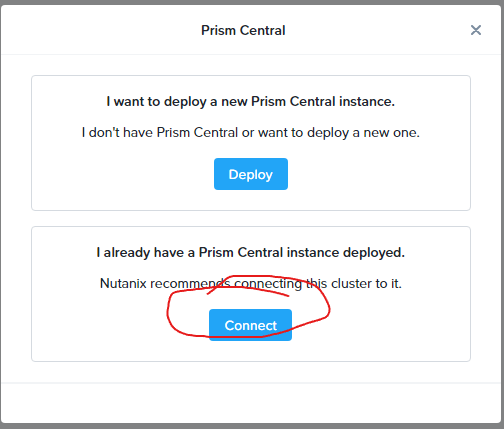

Click `Next` on the `Connect Info` page and then put in the Prism Central IP address `192.168.103.252`, port of `9440`, and the admin username and password you just set up for Prism Central.

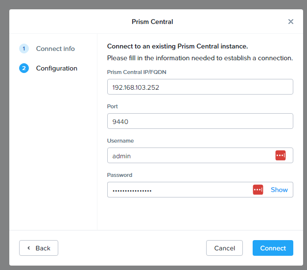

After a few seconds, registration will complete. You will need to refresh the page to see the updated registration status. Now we can go login to Prism Central.

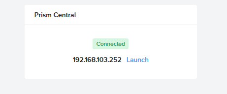

### 5. Configure Prism Central

Let's start setting up some basic settings in Prism Central. So let's go back to the Prism Central window. Start by clicking the gear icon in the upper right corner of the Prism Central UI and selecting `Name Servers` from the settings menu on the left. Then add some public DNS servers to the list, we'll use `1.1.1.1` and `8.8.8.8`.

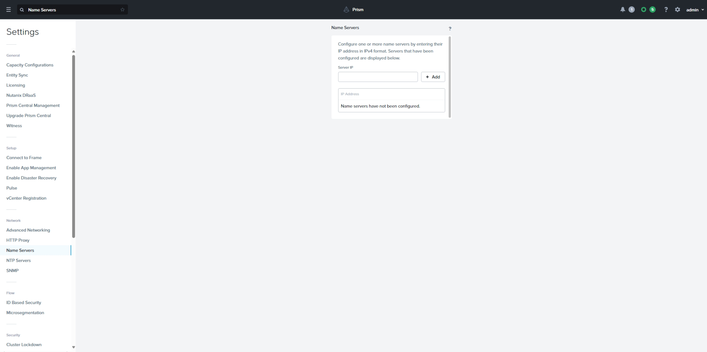

Next click on NTP Servers on the left and add a local NTP pool server for the region you deployed Nutanix into. We'll use `0.north-america.pool.ntp.org`

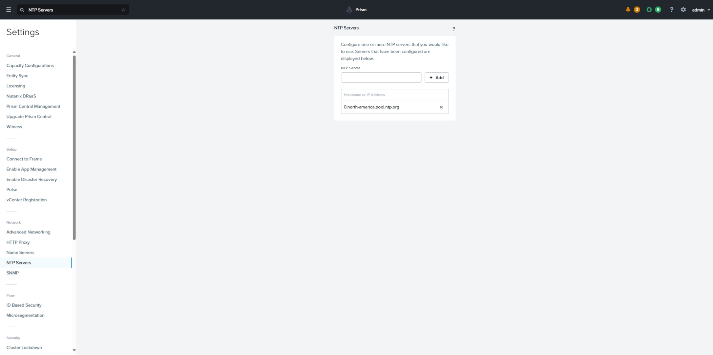

In the next part we'll deploy another piece of the Nutanix stack onto the cluster.

## Discussion

Before proceeding to the next part let's take a few minutes to discuss what we did. Here are some questions to start the discussion.

- What is Prism Central?
- What can you do with Prism Central that you couldn't do with just Prism?
