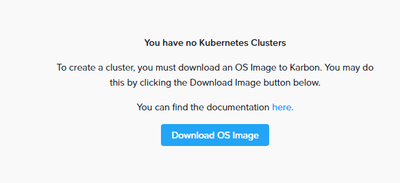
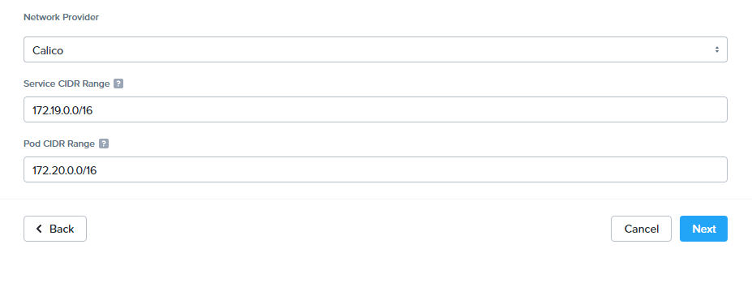
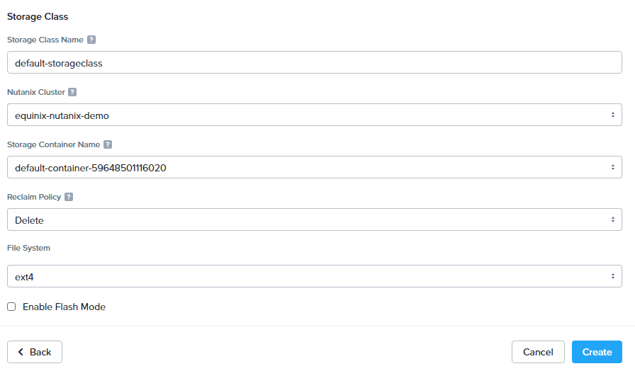

<!-- See https://squidfunk.github.io/mkdocs-material/reference/ -->

# Part 6: Deploy Nutanix Kubernetes Engine

Nutanix Kubernetes Engine (NKE) is a managed Kubernetes service that simplifies the deployment and management of Kubernetes clusters. NKE is integrated with Prism Central, so you can manage your Kubernetes clusters alongside your other Nutanix workloads.

## Steps

### 1. Open Prism UI

Let's login to the Prism Central UI from your computer at `https://localhost:19440`. Note that the Prism UI ships with a self-signed TLS certificate, so most browsers will display a security warning. This security warning is unavoidable. If your browser will allow you to ignore the warning and load the site, do that; if not, try a different browser.

### 3. Enable Kubernetes Engine

Click on the three lined menu in the upper left of the Prism Central UI and select `Services` -> `Kubernetes`. Then click `Enable Karbon` or `Enable Kubernetes`. Which one you'll see depends on the version of the Nutanix Kubernetes Engine you have installed, which we'll be updating anyway in the next step. After a while it will start up and tell you there are no kubernetes clusters. That's fine, continue on to the next step.



### 2. Update the Cluster

Click on the three lined menu in the upper left of the Prism Central UI and select `Administration` -> `LCM`. Then click the `Inventory` tab and choose `Perform Inventory`. You can leave the `Enable Auto Inventory` checkbox unselected for now. Click `Proceed`.

The inventory may take a long time to complete and afterwards you will likely need to refresh the page.

Then navigate to the `Updates` -> `Software` tab.

We need to update the Nutanix Kubernetes Engine, you can also update other components like NCC while you are here.

### 3. Deploy Nutanix Kubernetes Engine

Click on the three lined menu in the upper left of the Prism Central UI and select `Services` -> `Kubernetes`. Then click `Download OS Image`. Wait until the `Download Status` is `Downloaded`.


Now back to Clusters on the left and click `Create Kubernetes Cluster`.


Choose `Development Cluster` as the type and click `Next`.


Name it `k8s-demo` and click `Next`.


Leave the Node Network as `VM Network` and the number of workers as 1 and click `Next`.


We'll use the default networking provider, so just click `Next`.



On the Storage Class page, leave the options as their defaults, and click `Create`.



Click `Create`. You may need to refresh to see the cluster creation status. Now just wait for the cluster to finish deploying.

### 4. Download the kubeconfig file

Congrats, you now have a kubernetes cluster on your Nutanix cluster.
Download the kuberconfig file via the browser:


Transfer it to your bastion host:

```sh
scp -i $(terraform output -raw ssh_private_key) <path-to-downloads>/k8s-demo-kubectl.cfg root@$(terraform output -raw bastion_public_ip):~/kubeconfig
```

### 5. Access the Kubernetes cluster

Now that you have the kubeconfig file on your bastion host, you can access the Kubernetes cluster from your computer. First, SSH into the bastion host:

```sh
ssh -i $(terraform output -raw ssh_private_key) root@$(terraform output -raw bastion_public_ip)
```

Then, set the `KUBECONFIG` environment variable to point to the kubeconfig file:

```sh
export KUBECONFIG=$(pwd)/kubeconfig
```

Install kubectl (shown here via snap):

```sh
snap install kubectl --classic
```

Now you can use `kubectl` to interact with your Kubernetes cluster:

```sh
kubectl get nodes
```

```sh
kubectl get pods -A
```

## Discussion

Before proceeding to the next part let's take a few minutes to discuss what we did. Here are some questions to start the discussion.

- What is Nutanix Kubernetes Engine?
- How does NKE integrate with Prism Central?
- What are some use cases for NKE?
- How does NKE compare to other managed Kubernetes services?
