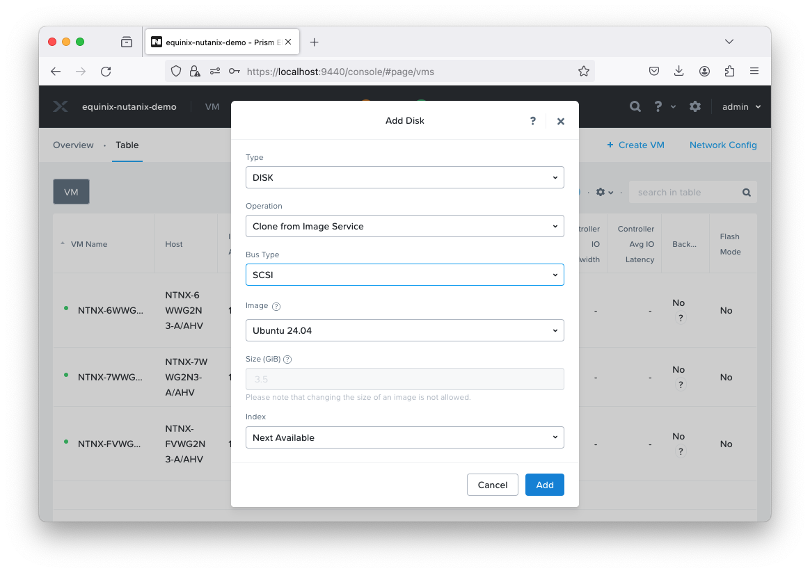
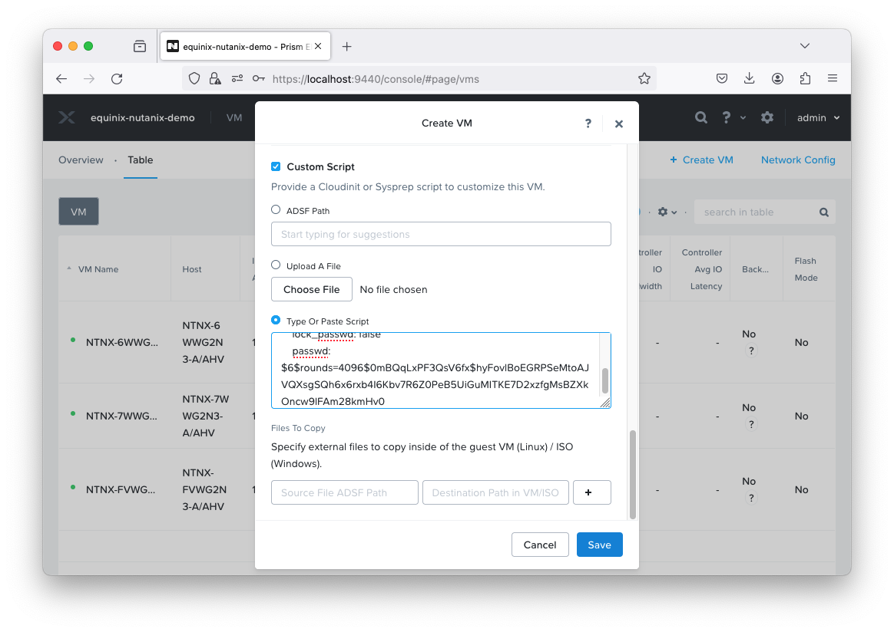
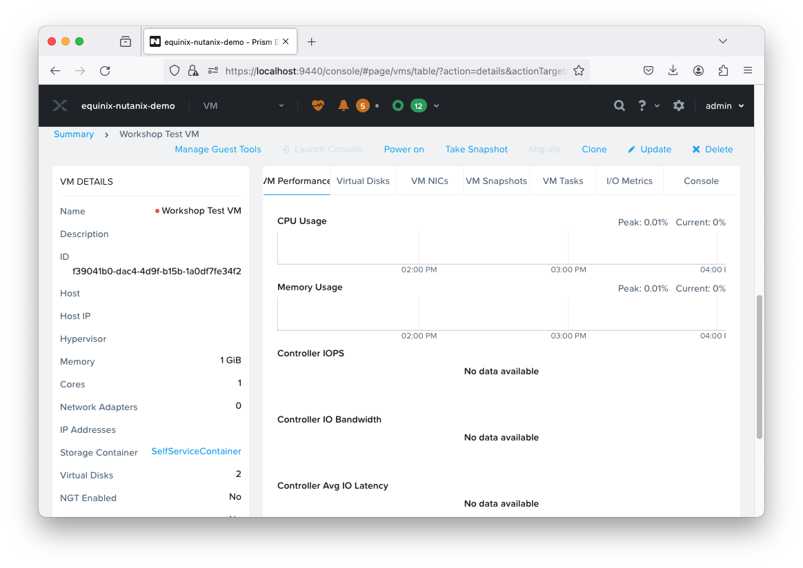
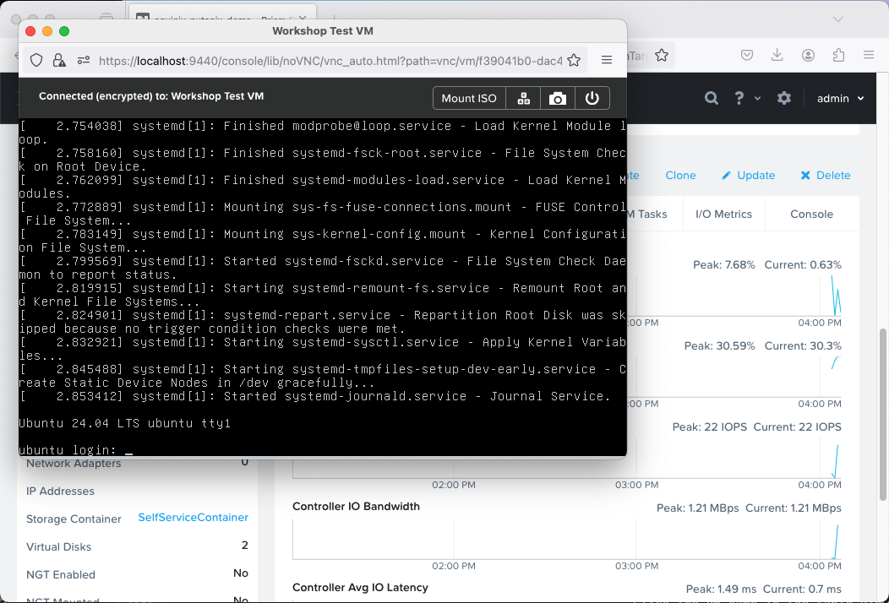

<!-- See https://squidfunk.github.io/mkdocs-material/reference/ -->
# Part 4: Create a Virtual Machine

To get a sense of the capabilities of our Nutanix cluster, we will now deploy a Virtual Machine (VM) on the cluster and connect to the VM console.

In order to connect to the VM console, we need to deploy a VM that has an operating system (OS) installed.  In a Nutanix cluter, this means we have to create an OS image that can be added to a VM on creation.

In this workshop, we will use an Ubuntu cloud image.  We are going to use [ubuntu-24.04-minimal-cloudimg-amd64.img](https://cloud-images.ubuntu.com/minimal/releases/noble/release/ubuntu-24.04-minimal-cloudimg-amd64.img) in the steps below, but you can [browse the complete directory of images](https://cloud-images.ubuntu.com/) and choose a different image if desired.

## Steps

### 1. Add an OS image

Click the drop-down menu in the top navigation bar in your Prism UI and select the "Settings" option to navigate to the Settings page.

In the left-hand navigation, find the "Image Configuration" item and click it.

Click the "Upload Image" button and fill out the form
that pops up.  Under "Image Type" select "DISK."  Under "Image Source" on the form, select "From URL" and enter `https://cloud-images.ubuntu.com/minimal/releases/noble/release/ubuntu-24.04-minimal-cloudimg-amd64.img` in the form field (or specify a different image URL of your choosing).


### 2. Create a VM

Once your image is created, click the drop-down menu in the top navigation bar and select the "VM" option.

Click the "+ Create VM" button and fill out the form that pops up.  For our purposes, 1 vCPU and 1 GiB memory are plenty.  Scroll down "Disks" section of the form and click "+ Add New Disk".

In the "Add Disk" form, change the "Operation" dropdown to "Clone from Image Service", then ensure that image selected in the "Image" dropdown is the one you created in the previous step. Click the "Add" button to add the disk configuration to your VM and return to the "Create VM" form.



In order to connect to the VM console, we need to add a user that can log in with a password.  We will use a `cloud-init` config to do that.  Scroll down to the bottom of the "Create VM" form, check the "Custom Script" box, then select the "Type or Paste Script" radio button so that you can add your `cloud-init` script.



We'll pass in a `cloud-init` that adds a user named "workshop" with the password "ubuntu":

```yaml
#cloud-config
users:
  - default
  - name: workshop
    lock_passwd: false
    passwd: $6$rounds=4096$0mBQqLxPF3QsV6fx$hyFovlBoEGRPSeMtoAJVQXsgSQh6x6rxb4I6Kbv7R6Z0PeB5UiGuMITKE7D2xzfgMsBZXkOncw9lFAm28kmHv0
```

Click the "Save" button and Nutanix will start creating your VM.

### 3. Connect to the VM console

When Nutanix finishes creating your VM, you will have to turn it on.  Click the VM name in the table view and then scroll down to see the VM details.  Click the "Power On" link and wait for your VM to power on.



When your VM finishes powering on, click the "Launch Console" button to open the VM console.  Enter the username "workshop" and the password "ubuntu" at the prompt and you will have an open terminal session on your VM.  Try out some of your favorite commands, and when you're done, close the VM console and click the "Delete" button in the Prism UI to delete your VM.



## Discussion

Before proceeding to the next part let's take a few minutes to discuss what we did. Here are some questions to start the discussion.

- Other than VMs, what resources can be created in the Prism UI?
- Can you connect to VMs on a Nutanix cluster without going through a bastion host?
